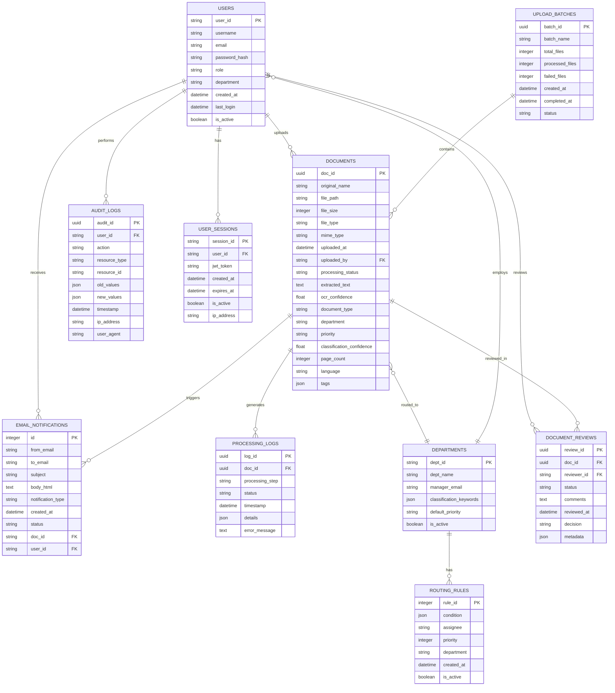

# IDCR System - Entity Relationship Diagram

## Database Schema Overview

## Entity Descriptions

### USERS
- **Primary Entity**: System users with role-based access
- **Key Attributes**: user_id, username, email, role, department
- **Roles**: admin, manager, employee, general
- **Departments**: hr, finance, legal, it, operations, support

### DOCUMENTS
- **Primary Entity**: Core document storage and metadata
- **Key Attributes**: doc_id, original_name, file_path, document_type, department
- **Processing States**: pending, processing, completed, failed, error
- **Document Types**: invoice, contract, report, policy, request, etc.

### EMAIL_NOTIFICATIONS
- **Communication Entity**: Email notification system
- **Key Attributes**: from_email, to_email, subject, notification_type
- **Types**: document_upload, approval_request, status_update, system_alert

### PROCESSING_LOGS
- **Audit Entity**: Document processing history
- **Key Attributes**: processing_step, status, timestamp
- **Steps**: upload, ocr, classify, route, review, complete

### DEPARTMENTS
- **Organizational Entity**: Department configuration
- **Key Attributes**: dept_name, manager_email, classification_keywords
- **Supports**: Dynamic routing rules and classification

### DOCUMENT_REVIEWS
- **Workflow Entity**: Document approval workflow
- **Key Attributes**: reviewer_id, status, decision, reviewed_at
- **Statuses**: pending, approved, rejected, needs_revision

## System Relationships

### Core Workflow Relationships

1. **User → Document**: One-to-Many
   - Users can upload multiple documents
   - Each document has one uploader

2. **Document → Processing_Logs**: One-to-Many
   - Each document generates multiple processing logs
   - Tracks complete processing lifecycle

3. **Document → Email_Notifications**: One-to-Many
   - Document events trigger multiple notifications
   - Notifications sent to relevant departments/users

4. **Department → Documents**: One-to-Many
   - Documents are routed to specific departments
   - Each department handles multiple documents

5. **User → Document_Reviews**: One-to-Many
   - Managers can review multiple documents
   - Each review is performed by one user

### Authentication & Security Relationships

1. **User → User_Sessions**: One-to-Many
   - Users can have multiple active sessions
   - JWT token management

2. **User → Audit_Logs**: One-to-Many
   - All user actions are logged
   - Complete audit trail

### Classification & Routing Relationships

1. **Department → Routing_Rules**: One-to-Many
   - Each department has classification rules
   - Rules determine document routing

2. **Documents → Upload_Batches**: Many-to-One
   - Batch processing for multiple documents
   - Tracking batch processing status

## Business Rules

### Document Processing Flow
1. **Upload** → User uploads document
2. **Classification** → AI/ML classifies document type and department
3. **Routing** → Document routed to appropriate department
4. **Notification** → Email sent to department managers
5. **Review** → Manager reviews and approves/rejects
6. **Completion** → Final status update and notifications

### Access Control Rules
- **General Users**: Can upload documents and view their own uploads
- **Department Managers**: Can review documents in their department
- **Admins**: Full system access and configuration

### Notification Rules
- **Upload Notifications**: Sent to department managers
- **Status Updates**: Sent to original uploaders
- **System Alerts**: Sent to administrators

This ER diagram represents the complete data architecture of the IDCR system, showing how documents flow through the system from upload to completion, with proper user management, audit trails, and notification systems.
